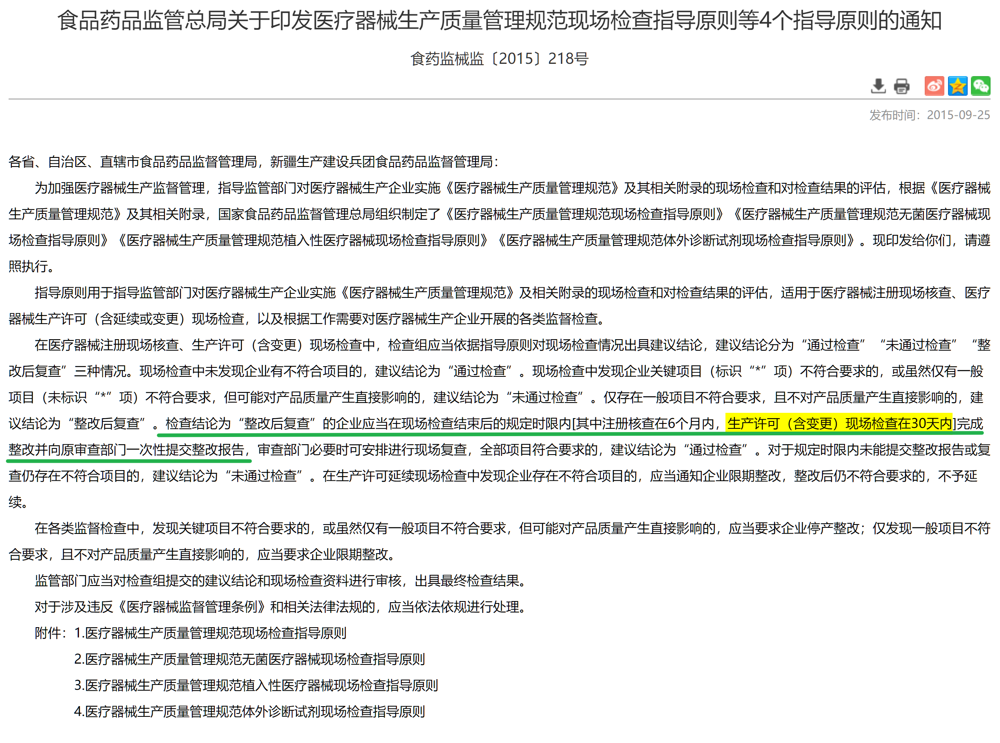

# mariverse

## 韩东，I'm watching you.

我看了下，这是省药监局飞检发现的问题[^inspection]，那么根据药监总局印发现场指导原则的通知[^field]，生产许可现场检查会要求限期在 **30 天内**完成整改。

[^inspection]: https://mpa.gd.gov.cn/zwgk/jgsz/ylqxaqjgc/fxjc/content/post_4510524.html

[^field]: https://www.nmpa.gov.cn/xxgk/fgwj/gzwj/gzwjylqx/20150925120001645.html#:~:text=30天内

国家市场监督管理总局于 2022 年通过的[《医疗器械生产监督管理办法》](https://www.gov.cn/gongbao/content/2022/content_5691002.htm/#:~:text=第七十六条)第五章法律责任第七十六条说明：

> 第七十六条　违反医疗器械生产质量管理规范，未建立质量管理体系并保持有效运行的，由药品监督管理部门依职责**责令限期改正**；影响医疗器械产品安全、有效的，依照**医疗器械监督管理条例第八十六条**的规定处罚。

更详细的处置在国务院颁发的[《医疗器械监督管理条例》](https://www.gov.cn/zhengce/content/2021-03/18/content_5593739.htm#:~:text=第八十六条)第七章法律责任第八十六条。

> 第八十六条　有下列情形之一的，由负责药品监督管理的部门责令改正，没收违法生产经营使用的医疗器械；违法生产经营使用的医疗器械货值金额不足1万元的，并处2万元以上5万元以下罚款；货值金额1万元以上的，并处货值金额5倍以上20倍以下罚款；**情节严重的，责令停产**停业，直至由原发证部门吊销医疗器械注册证、医疗器械生产许可证、医疗器械经营许可证，对违法单位的法定代表人、主要负责人、直接负责的主管人员和其他责任人员，没收违法行为发生期间自本单位所获收入，并处所获收入30%以上3倍以下罚款，10年内禁止其从事医疗器械生产经营活动：
> 
>（一）生产、经营、使用不符合强制性标准或者不符合经注册或者备案的产品技术要求的医疗器械；
>
>（二）未按照经注册或者备案的产品技术要求组织生产，或者**未依照本条例规定建立质量管理体系并保持有效运行**，影响产品安全、有效；
>
>（三）经营、使用无合格证明文件、过期、失效、淘汰的医疗器械，或者使用未依法注册的医疗器械；
>
>（四）在负责药品监督管理的部门责令召回后仍拒不召回，或者在负责药品监督管理的部门责令停止或者暂停生产、进口、经营后，仍拒不停止生产、进口、经营医疗器械；
>
>（五）委托不具备本条例规定条件的企业生产医疗器械，或者未对受托生产企业的生产行为进行管理；
>
>（六）进口过期、失效、淘汰等已使用过的医疗器械。

省药监局公告所称的**存在严重缺陷**，应该就是情节严重了。
