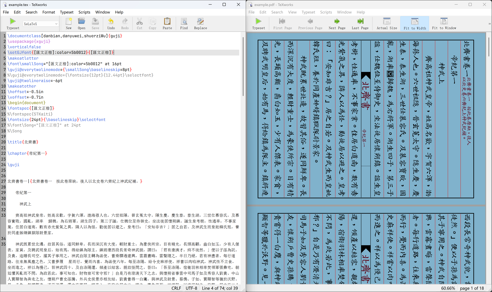

import { GithubCard } from 'astro-pure/advanced'
import { Collapse } from 'astro-pure/user'
import { Image } from 'astro:assets'
import stelePhoto from './digitalize-inscription/stele-photo.jpg'
import xeguji_xetex from './digitalize-inscription/YIN-xeguji-xetex.png'
import xeguji_xelatex from './digitalize-inscription/YIN-xeguji-xelatex.png'
import luatexja_directions from './digitalize-inscription/luatexja-directions.png'
import luatexja_box from './digitalize-inscription/luatexja-box.png'
import inscription_without_centered_punctuation from './digitalize-inscription/inscription-without-centered-punctuation.png'
import inscription_with_centered_punctuation from './digitalize-inscription/inscription-with-centered-punctuation.png'
import compare from './digitalize-inscription/compare.jpg'

{/* Astro docs about images in mdx file
https://docs.astro.build/en/guides/images/#images-in-mdx-files */}

## 缘起
2025 年在家乡抚州过年的时候，赶着春光明媚在市人民公园里乱窜，注意到小坡上的木亭旁，还立有一幢先前印象中未曾留意的石碑。凑近一看，原来石碑上记录了抚州市民于上世纪 80 年代末疏浚公园内人工湖的历史，刻为**《<abbr title="此西湖非大名鼎鼎的杭州西湖，而取坐落城西之意">西湖</abbr>治理志》**，保留着从右向左的繁体中文阅读顺序。碑文字迹工整，正文和落款染色各异，正文似用金粉或铜粉铺写，落款则以某种灰褐色染料拓印而成。是时，部分碑文已有拖影尾曳之态，碑文旁的标语更是褪色完全，想来是自立碑三十余年以来风吹雨打不断侵蚀的结果。所幸，当时的石匠或机器入石三分，笔力雄劲，标语的轮廓依旧清晰可辨，能辨认出“治理西湖 造福人民”的动员口号。茂密的草木遮蔽了石碑足部，裂痕也爬上了石碑的躯干，既是无声地独白岁月沧桑不返，又是慈祥地观察人间悠悠百态。我觉得作为生于斯长于斯的孩子必须要做点什么，我要将这块家乡碑文尽可能地 1:1 数字化复刻。抚州身处江南，是个多雨又酷暑的城市，哪怕未来石碑荣休了，后人还有另一种追溯历史的方式。

<figure style={{ textAlign: 'center' }}>
  <Image src={stelePhoto} alt="Park Stele Inscription" />
  <figcaption>公园石碑</figcaption>
</figure>

我当场掏出手机对石碑全貌和几处碑文细节拍照。回家之后，为了完成 1:1 复刻的目标，自然决定用 $\LaTeX$ 进行数字化处理。
$\LaTeX$ 的介绍和资料已经很多了，这里不赘述了，感兴趣的读者可以参考 CTEX 小组的 GitHub 仓库。

<GithubCard repo="CTeX-org/lshort-zh-cn" />

## 抉择
我在临近本科毕业开始接触到 $\LaTeX$ ，最初是打算使用XJTU 学位论文 $\LaTeX$ 模板写毕设论文，但这个模板仅适用硕士和博士学位，那会没去问学院对本科论文是否采纳 $\LaTeX$ ，所以最终还是用 M\$ Word + Zotero 完成了本科论文。倒是在校招简历制作上满足了使用 $\LaTeX$ 的尝试想法。

<GithubCard repo="obster-y/XJTU-thesis" />

话说回来，我以往 $\LaTeX$ 写作都是按现代行文规范从左向右调用预设的文档类就行，根本不知道如何从自左向右的现代汉语横排改为自右向左的传统汉语竖排。竖排也被叫做直排。

最开始想薅网友的解决方案，发现国内中文竖排实践很少。这倒也是，毕竟通常只有古籍或讲古的现代书才会采用竖排，不仅需要专门的排版处理，而且搜寻到的资料相当一部分已经成了时代的眼泪。

### 中文竖排的割注
起初，我仔细翻阅了 CTEX 开发小组所撰写的面向中文科技排版的手册——[<abbr title="The Not So Short Introduction To LaTeX2ε (Chinese Edition)">Ishort-zh-cn</abbr>](https://github.com/CTeX-org/lshort-zh-cn)——其中也没有介绍竖排行文。

我又从 [LaTeX Studio](https://www.latexstudio.net/archives/536) 看到了中科大的 Dian YIN 前辈早在 2007 年就尝试了中文竖排下<abbr title="在正文行间插入的双行小字注释">割注</abbr>的实践，并发布在 [Google Code](https://code.google.com/archive/p/xeguji/)。Google Code 已于 2016 年关停，现归档至 Google Code Archive，Archive 保留的 commit 记录显示发布在 2007 年 5 月，此后未有维护和更新活动了。

把源码下载下来，能看到有两个分支文件夹，`trunk` 需要用 Plain XeTeX 编译，`branches` 则是基于 `trunk` 的 $\LaTeX$ 集成版本。

```console title="xeguji&nbsp;SVN&nbsp;目录结构"
xeguji/
├─ branches/        # LaTeX 集成版本
│  ├─ .svn/
│  ├─ example.tex
│  ├─ guji.cls
│  ├─ hsplit.sty
│  ├─ xguji.sty
│  └─ xgujifnt.sty
├─ tags/            # 无有效内容
│  └─ .svn/
└─ trunk/           # Plain XeTeX 版本
   ├─ .svn/
   ├─ hsplit.sty
   ├─ testgj.tex
   ├─ xguji.sty
   └─ xgujifnt.sty
```

进入 `trunk` 文件夹，`testgj.tex` 是作者提供的《后汉书·光武帝纪》测试用例。我当时试着在 TeXworks 跑 `testgj.tex` 时，编译报错系统未安装原作者调用的 Adobe Song Std 字体。字体换成 Windows 11 自带的宋体（`SimSun`），直接一次性跑通了。提醒一下，$\LaTeX$ 的字体调用是大小写敏感的。

```console title="error&nbsp;when&nbsp;font&nbsp;not&nbsp;found"
(./testgj.tex
LaTeX2e <2024-11-01> patch level 2
L3 programming layer <2025-03-26>
! Font \Song="Adobe Song Std:vertical:script=hani:+vhal" at 16.0pt not loadable
: Metric (TFM) file or installed font not found.
l.5 ...ong Std:vertical:script=hani:+vhal" at 16pt
```

```tex title="testgj.tex"
\font\Song="Adobe Song Std:vertical:script=hani:+vhal" at 16pt # [!code --]
\font\smallSong="Adobe Song Std:vertical:script=hani:+vhal" at 8pt # [!code --]
\font\Song="SimSun:vertical:script=hani:+vhal" at 16pt # [!code ++]
\font\smallSong="SimSun:vertical:script=hani:+vhal" at 8pt # [!code ++]
```

编译前注意选择正确的排版引擎 `XeTeX`，`trunk` 下的 `testgj.tex` 如果用的是 `XeLaTeX` 编译，而不是 `XeTeX` 编译，将会遇到如下报错。

```console title="error&nbsp;when&nbsp;build&nbsp;testgj.tex&nbsp;with&nbsp;XeLaTeX"
(./testgj.tex
LaTeX2e <2024-11-01> patch level 2
L3 programming layer <2025-03-26>
(./xguji.sty (./hsplit.sty)) (./xgujifnt.sty)
! Use of \line  doesn't match its definition.
l.39 \line{
           \hrulefill}
? 
```

输出的 PDF 效果如下。

<figure style={{ textAlign: 'center' }}>
  <Image src={xeguji_xetex} alt="xeguji-xetex" />
  <figcaption>xeguji 包 trunk 分支使用 `xetex` 编译 testgj.tex</figcaption>
</figure>

`branches` 中 `example.tex` 则使用了 `TW-Kai-95_1_3_xuanzhuan.ttf`，大概率是原作者自己修改的旋转字体。
我没找到现成的旋转字体，就用一款很漂亮的繁体中文字体——[匯文正楷](https://zhuanlan.zhihu.com/p/12669052378)——测试了。
同样将原来使用的 `TW-Kai-95_1_3_xuanzhuan.ttf` 字体全部替换成本地字体名，使用 `xelatex` 编译成功。
输出的 PDF 效果见下。 

<figure style={{ textAlign: 'center' }}>
  <Image src={xeguji_xelatex} alt="xeguji-xelatex" />
  <figcaption>xeguji 包 branches 分支使用 `xelatex` 编译 example.tex</figcaption>
</figure>


如果是提前逆时针旋转 90° 的字体，最终效果将与下图类似。

<figure style="text-align: center">
  
  <figcaption>竖排线装书 credit: 知乎 \@贫困的思想[^zhvt-classic]</figcaption>
</figure>

虽然确实 `xeguji` 做出了竖排的效果，但是改造成本太高了。Dian YIN 前辈是自己写了 `xguji.sty` 宏样式，提供 `\guji ...\endguji` 环境来中文竖排，但这个 workaround 感觉太重了，竖排时的两端对齐也有问题。而碑文是两端对齐的，未达到我理想中的 1:1 复刻。所以我又寻求了其他方法。

<Collapse title="割注">
多补充一些，割注（日语：warichu，わりちゅう）是日文排版术语[^warichu]，中文排版下可能更常用“夹注”或“行内注”。如果注释跟正文不同行（竖排时则不同列），这种情况在日文排版中被称作 ruby。另外推荐 B 站上对 ruby 排版的科普视频，视频作者很好地串联起了东亚文化圈排版历史的变迁。

<figure style="text-align: center">
  
  <figcaption>Japenese Ruby[^ruby]</figcaption>
</figure>

</Collapse>

### 知乎答主的解法
更多对中文竖排的 $\LaTeX$ 排版实现讨论集中在知乎，2022 年前的竖排手段有三：
1. 放弃中文 $\LaTeX$ 社区所使用的主流排版引擎 XeTeX 和 XeLaTeX，改用日本的本地化排版引擎 $p\TeX$ 或 $up\TeX$。但网络上说 $up\TeX$ 的中文支持需要额外配置，而且不适配 XeLaTeX 生态下丰富的宏包。我在 [这篇博客](https://rossea.github.io/2023-01-30-Vertical-book-using-UpLaTeX-1) 上看到了使用 $up\TeX$ 中文竖排，但在我的环境中没成功跑通。Stack Exchange 上的解法也不适用。无果，便放弃了。
2. 学习新的基于 $\LaTeX$ 的排版系统 ConTeXt，上手成本也不低。我看了下 ConTeXt 的介绍，一阵头大。这条路我没有尝试。
3. 保留 XeLaTeX 的开发环境，先把汉字转 90° 再去转纸面，但这会引入新的中英文基线不平齐的问题。这种实现也不优雅，我尝试下来横排时合适的视觉重心直接旋转到竖排时，感觉怪怪的。

途中我还在知乎上看到不同答主分享各自封装好的古籍对开装帧排版，完成度很高，效果上乘已经靠近出版级别了，但于我而言是“大材小用”。

幸好，知乎答主 RadioNoiseE 在 [2024 年的回答](https://zhihu.com/question/20544732/answer/3456651969)指明了相对现代的中文竖排方案：`LuaTeX-ja`，该宏包使用 Lua(La)TeX 排版引擎，支持日文排版（实际只要字体支持，也可以中文排版）。可以在 <abbr title="Comprehensive TeX Archive Network">CTAN</abbr> 在线获取[包的信息和使用文档](https://ctan.org/pkg/luatexja)。幸好这些日本人额外编写了英文的使用手册，不然日文除了五十音图外我真一点看不懂🥲。

~~看日本人用英文写的 `luatexja` 文档，莫名有点幽默感怎么回事。~~

如果本地已经安装了 $\TeX$ 发行版和 `luatexja` 宏包，可以通过 `texdoc luatexja` 命令打开本地安装的使用文档，或者使用 `texdoc --list luatexja` 交互式选择打开哪个文档。

```powershell
PS C:\Users\34901\Downloads> texdoc --list luatex-ja
 1 c:\program files$\LaTeX$live\2025$\LaTeX$mf-dist\doc\luatex\luatexja\luatexja-en.pdf
   = [en] Package documentation (English)
 2 c:\program files$\LaTeX$live\2025$\LaTeX$mf-dist\doc\luatex\luatexja\luatexja-ja.pdf
   = [ja] Package documentation (Japanese)
 3 c:\program files$\LaTeX$live\2025$\LaTeX$mf-dist\doc\luatex\luatexja\lltjp-geometry.pdf
 4 c:\program files$\LaTeX$live\2025$\LaTeX$mf-dist\doc\luatex\luatexja\ltjclasses.pdf
 5 c:\program files$\LaTeX$live\2025$\LaTeX$mf-dist\doc\luatex\luatexja\ltjltxdoc.pdf
 6 c:\program files$\LaTeX$live\2025$\LaTeX$mf-dist\doc\luatex\luatexja\ltjsclasses.pdf
 7 c:\program files$\LaTeX$live\2025$\LaTeX$mf-dist\doc\luatex\luatexja\luatexja-ruby.pdf
 8 c:\program files$\LaTeX$live\2025$\LaTeX$mf-dist\doc\luatex\luatexja\readme
   = Readme
Enter number of file to view, RET to view 1, anything else to skip:
```

虽然上面我揶揄了一下，但是我还是要给宏包作者和文档作者竖大拇指的。`luatexja` 的文档说明非常详细，而且通俗易懂，通篇读完对排版知识和实现细节会有更深的认识。

`luatexja` 提供了对标 $p\TeX$ 的四种行文方向，yoko 就是横排，tate 就是竖排。

<figure style={{ textAlign: 'center' }}>
  <Image src={luatexja_directions} alt="luatexja-direction" />
  <figcaption>luatexja 支持四种行文方向</figcaption>
</figure>

我们已经知道 $\LaTeX$ 排版是基于盒子（box）的，如果你看了 [Ishort-zh-cn]((https://github.com/CTeX-org/lshort-zh-cn)) 或者其他 $\LaTeX$ 介绍的话。盒子相当于前端开发或者 GUI 布局的容器，`\hbox` 命令用来创建水平盒子，`\vbox` 命令创建垂直盒子。luatex-ja 搭配盒子，便可同时灵活处理横排和竖排的内容。

<figure style={{ textAlign: 'center' }}>
  <Image src={luatexja_box} alt="luatexja-box" />
  <figcaption>luatexja 盒子使用示例</figcaption>
</figure>

当然，对于我这个碑文全文竖排目标，不需要额外重复使用盒子。luatexja 封装了六种文档类 `ltjarticle.cls`，`ltjbook.cls`，`ltjreport.cls`，`ltjtarticle.cls`，`ltjtbook.cls`，`ltjtreport.cls`，其中后三个 `ltjt*.cls` 是专门的竖排文档类，其中的 t 估计是意指 tate 竖排，猜想全称是 **LuaTexJa Tate \* **，`ltj*.cls`则是横排文档类。

碑文短小精炼，既不属于书籍 book，也不宜视作报告 report。因而，选择在开头通过 `\documentclass{ltjtarticle}` 指定竖排文章文档类，为整个文档全局应用竖排。

## 复刻
根据 `luatexja` 文档说明，使用 \LaTeX 时，在导言区引入 `luatexja` 宏包。 我们还需要引入 `luatexja-fontspec` 宏包来配合设置字体，设置字体时额外指定 `TateFeatures = {JFM = {zh_CN/{quanjiao,vert}}}` 选项来启用竖排特性。
```tex title="inscription.tex"
\documentclass{ltjtarticle}
\usepackage{luatexja}  % load luatexja.sty as per documentation
\usepackage[]{luatexja-fontspec} % load luatexja-fontspec package for font configuration
\setmainjfont[TateFeatures = {JFM = {zh_CN/{quanjiao,vert}}}]{<Your-Font-Name>}>}
```

剩下就是一些内容填充和细节调整了，比如文字对齐、行间距调整、文字颜色。
不断微调，最后形成如下 `inscription.tex` 文件，使用 `lualatex` 编译后输出的 PDF 效果见下图。
```tex title="inscription.tex"
\documentclass{ltjtarticle}
\usepackage{luatexja}
\usepackage[]{luatexja-fontspec}
\usepackage{xcolor,geometry}
\pagestyle{empty}
\linespread{1.5}
\setmainjfont[TateFeatures = {JFM = {zh_CN/{quanjiao,vert}}}]{Kaiti}

\begin{document}
\begin{center}
    \Huge\color[HTML]{4A4335} 治理西湖 \hspace{1em} 造福人民
\end{center}
{\raggedleft
    \large 吳國煇\hspace{1em}一九八八年三月六日\hspace{10em}\par
}
\vspace{1em}

{\noindent\indent\indent\indent\indent
\fontsize{20.5pt}{12pt}\selectfont\color[HTML]{CCA44D}
西湖治理誌\indent\indent 西湖始建於一九六二年，因位於撫州城西而得名。\\
湖心有四島，水域面積十一·七二公頃，是人民公園水上遊覽場所和\\ 水產基地。
多年來，因城市生產和生活廢水大量注入，湖水污染，淤\\ 泥沉積，湖岸塌陷。
為治理污染，美化環境，造福人民，中共撫州市\\委、撫州市人民政府於一九八七年七月廿三日做出綜合治理西湖的決\\定。
總體工程分為清淤、护岸和污水處理三部分。
十月廿五日正式動\\工，全市人民累計十三萬餘人次經過五十餘天的義務勞動，共\\清運淤泥七萬餘立方米，护岸二千五百餘米，建污水處理池一\\座。
汗水蕩滌了污泥，勞動改善了環境，西湖又象一顆美麗的\\明珠鑲嵌在羊城的土地上，再次展現了汝水撫育的人民勤勞勇\\敢，艱苦創業的精神風貌。
故立此碑以誌留念。
}\\[-15pt]

{\raggedleft
    \fontsize{20.5pt}{12pt}\selectfont\color[HTML]{786660}
    撫州市西湖綜合治理工程指揮部\hspace{1em}\hspace{7em}\vrule\\*[10pt]
    一九八八年三越一日立\hspace{1em}翰青吴光國書\hspace{7em}\vrule\\
}
\end{document}
```

不断调整下来，碑文复刻已经很接近了，但标点没有居中。
<figure style={{ textAlign: 'center' }}>
  <Image src={inscription_without_centered_punctuation} alt="Digital Inscription Output without Centered Punctuation" />
  <figcaption>标点没有居中</figcaption>
</figure>

只要替换成标点居中的繁体中文字体就可以了，不是楷体，但具体换的哪个字体已经记不得也找不到了。本文更新时便拿[汇文仿宋](https://zhuanlan.zhihu.com/p/12669052378)字体做演示了，原因见[### 迟到且惨痛的更新]。

<figure style={{ textAlign: 'center' }}>
  <Image src={inscription_with_centered_punctuation} alt="Digital Inscription Output with Centered Punctuation" />
  <figcaption>标点居中了，心满意足</figcaption>
</figure>

最后，把石碑照片和数字化复刻的结果放在一起比较一下。其实个别字形还是有差异的。比如碑文中的“西”，内部是两竖，但我没找到相称的字体，略有遗憾。

<figure style={{ textAlign: 'center' }}>
  <Image src={compare} alt="Park Stele Inscription" />
  <figcaption>左：数字化复刻；右：石碑照片</figcaption>
</figure>

### 迟到且惨痛的更新
我之前一次误操作 rm -rf 了 `%USERPROFILE%/Documents` 目录下的所有文件，隔了 2 秒才反应过来 <kbd>Ctrl</kbd> + <kbd>C</kbd> 中断删除……之前整理的照片和工程文件大量丢失，只能靠之前的微信聊天记录中的只言片语赛博考古，这又何尝不是一种（再）数字化（苦中作乐.jpg）。

这件事告诉我们，~~总结要趁早~~，**备份要做好**。

虽然这篇博文及其相关工作未必能像图丫丫一样数字永生，毕竟发生过数据丢失事故，但我想，我终归是给我自己、给来到这里的你一个积极的交代。

## Further Reading
在探索中文竖排期间，我遇到众多排版爱好者对古籍线装书的有趣尝试，不乏制作精良、完成度很高的作品。故罗列若干贴在文末作为 Further Reading，欢迎感兴趣的读者去看看。敬意不分先后。

- 知乎上关于中文直排的讨论：https://zhihu.com/question/20544732

- 知乎答主\@\{贫困的思想\} 排版线装书[^zhvt-classic]：
<GithubCard repo="chianjin/zhvt-classic" />

- GitHub \@\{shanleiguang\} 中文古籍刻本風格直排電子書製作工具：
<GithubCard repo="shanleiguang/vRain" />

- 知乎用户\@\{黄复雄\} 分享使用 ConTeXt 制作的古籍电子书排版：https://zhuanlan.zhihu.com/p/585086996

- ConTeXt 排版介绍：
<GithubCard repo="contextgarden/not-so-short-introduction-to-context" />

- 知乎用户\@\{Steve Cheung\} 编写的 $up\LaTeX$ 教程：https://zhuanlan.zhihu.com/p/81728243

- 知乎用户\@\{舞年\} 用 $\LaTeX$ 竖排通用古籍：https://zhuanlan.zhihu.com/p/701773897

- <abbr title="World Wide Web Consortium">W3C</abbr> 和社区整理的汉字书写系统排版需求。https://www.w3.org/TR/clreq


[^zhvt-classic]: https://zhuanlan.zhihu.com/p/542455884
[^upTeX-zhihu-tutorial]: https://zhuanlan.zhihu.com/p/81728243
[^warichu]: https://w3.org/TR/jlreq/#inline_cutting_note
[^ruby]: https://w3.org/TR/jlreq/#usage_of_ruby
